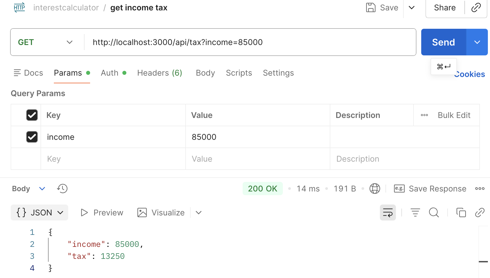
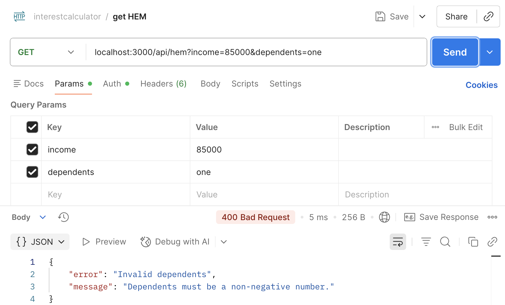

# Borrowing Power Calculator

A command line calculator that estimates a customer's maximum home loan borrowing power for a 30 year home loan. 

It collects annual income, dependants, declared monthly expenses, and credit card limit.
The calculator requests annual tax and the Household Expenditure Measure (HEM) from a local API, then calculates an estimated borrowing amount using an assessment interest rate.

This is a simplified borrowing power calculator. Results can be compared with the [Bendigo Bank borrowing-power calculator](https://www.bendigobank.com.au/personal/home-loans/calculators/borrowing-power/), but they are not expected to match exactly.


## Technologies

- Node.js built-in `fetch`, `readline`, and HTTP modules
- TypeScript
- Mocha for unit testing
- C8 for test coverage
- A local Node.js HTTP API for tax and HEM data (`server.js`)
- TSX to run TypeScript files in the CommonJS test environment

## Setup

1. Install dependencies:

   ```bash
   npm install
   ```

2. Create a `.env` file in the project root and set an API token:
   ```dotenv
   BORROWING_CALCULATOR_API_TOKEN=replace-with-your-local-token
   ```

3. In one terminal, start the local API:

   ```bash
   npm run api
   ```

4. In another terminal, start the calculator:

   ```bash
   npm start
   ```

5. Enter the requested values:
- gross annual income
- number of dependants
- declared monthly expenses
- total credit card limits

The calculator displays the estimated borrowing power, monthly repayment, annual tax, and HEM value.

Use `Ctrl+C` to stop the API when finished.


## Run tests
Run the automated test suite:

```bash
npm test
```
Tests mock fetch and readline, so they do not need the local API server or real terminal input.

To check the TypeScript source without generating output:

```bash
npm run typecheck
```

## Run coverage

Generate a coverage report:

```bash
npm run coverage
```

The test coverage includes `src/borrowingCalculator.ts`, which contains the calculator code covered by the tests. It excludes `server.js`, which acts as a mock external API for development.

The test suite passes with full coverage for `src/borrowingCalculator.ts`.

## API integration
The calculator calls the provided local API endpoints to retrieve:

- annual tax: GET `/api/tax?income=<income>`
- monthly HEM: GET `/api/hem?income=<income>&dependents=<dependents>`

Every request sends `Authorization: Bearer <BORROWING_CALCULATOR_API_TOKEN>`. The token is read from the local **.env** file and is never embedded in source code. 

`BORROWING_CALCULATOR_API_BASE_URL` is optional and defaults to http://localhost:3000

If an API request fails, the app uses the error message returned by the API when available. Otherwise, it shows a fallback message including the HTTP status code.

### Manual API testing

I used Postman to manually test the local API while `npm run api` was running. This confirmed that valid requests return the expected JSON response and invalid requests will return corresponding error responses.

#### Postman
**Successful request**

Example: retrieving annual tax for an income of `$125,000`.


### Invalid request
Example: retrieving HEM value for an income of `$125,000` and `1` dependent.


#### curl commands
You can also test the tax endpoint using `curl`:
```bash
curl -H "Authorization: Bearer <BORROWING_CALCULATOR_API_TOKEN>" \
  "http://localhost:3000/api/tax?income=85000"
```

## Thought process

I separated the calculator into small functions with one responsibility each:
- `getTax` requests annual tax.
- `getHEM` requests the monthly HEM baseline.
- `fetchApiJson` contains shared API request and error handling logic.
- `calculateBorrowingPower` combines income, tax, expenses, HEM, and credit card liability.
- `runConsoleMode` manages terminal prompts and displays the result.

I used TypeScript to type safe API responses and calculator results. The `APIResponse` helper is generic but restricted to the response shapes used by this calculator, which makes the expected data clear at each call.

The unit tests focus on these behaviours: 
- successful and zero-capacity calculations
- API requests and errors
- missing authentication
- rounding to two decimals
- console interaction with mocked dependencies

## Assumptions
- Tax is an annual amount and HEM is a monthly amount.
- The higher of declared expenses and HEM is used for monthly living expenses.
- Credit card liability is assessed at 3% of total credit limits per month.
- The assessment rate is the 7% baseline rate plus a 3% buffer.
- The loan term is 30 years.
- The running app makes real requests to the provided local development API.
- Tests mock API calls so they do not depend on the local API server.
