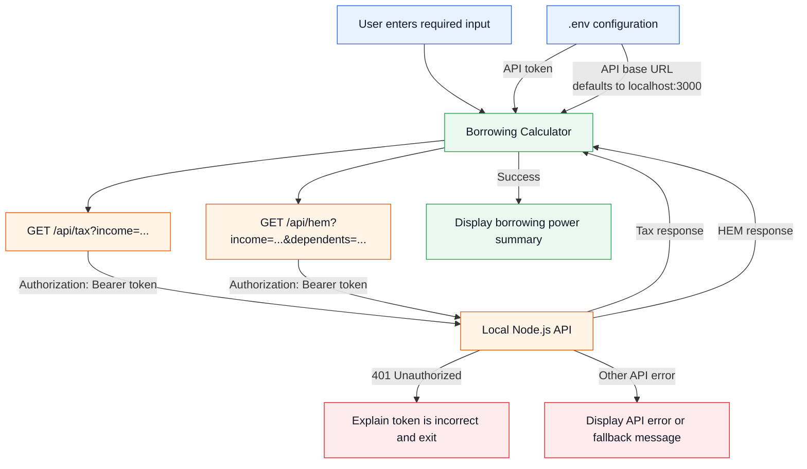

# Borrowing Power Calculator

A command line calculator that estimates a customer's maximum home loan borrowing power for a 30 year home loan. 

It collects annual income, dependants, declared monthly expenses, and credit card limit.
The calculator requests annual tax and the Household Expenditure Measure (HEM) from a local API, then calculates an estimated borrowing amount using an assessment interest rate.

This is a simplified borrowing power calculator.

## Technologies

- Node.js 
- TypeScript
- Mocha (unit testing)
- C8 (test coverage)
- local Node.js HTTP API (`server.js`)
- TSX (let JavaScript tests run TypeScript code)

## How to Set Up

1. Install dependencies:

   ```bash
   npm install
   ```

2. Create a `.env` file in the project root and set an API token:
   ```dotenv
   BORROWING_CALCULATOR_API_TOKEN=replace-with-your-local-token
   ```

## How to Run Application

3. Start the local API:

   ```bash
   npm run api
   ```

4. In another terminal, start the calculator:

   ```bash
   npm start
   ```

5. Enter the requested values:
- gross annual income
- number of dependants
- declared monthly expenses
- total credit card limits

The calculator displays the estimated borrowing power, monthly repayment, annual tax, and HEM value.

## How to Run Tests
Run the unit tests:

```bash
npm test
```

The unit tests focus on these behaviours:
- borrowing power calculations, including HEM and declared expenses
- API requests and authentication errors
- result rounding to two decimals
- console input, output, and validation prompts
- handling of unexpected calculation errors

## How to Run Coverage

Generate a coverage report:

```bash
npm run coverage
```

## API Integration



### API Testing

I used Postman to manually test the local API while `npm run api` was running. This confirmed that valid requests return the expected JSON response and invalid requests will return corresponding error responses.

#### Postman
**Successful Request**

Example: retrieving annual tax for an income of `$85,000`.


### Invalid Request
Example: retrieving HEM value for an income of `$85,000` and `1` dependent.


#### `curl` Commands
You can also test the tax endpoint using `curl`:
```bash
curl -H "Authorization: Bearer <BORROWING_CALCULATOR_API_TOKEN>" \
  "http://localhost:3000/api/tax?income=85000"
```

## Thought Process

I separated the calculator into small functions with one responsibility each:
- `getTax` requests annual tax.
- `getHEM` requests the monthly HEM baseline.
- `fetchApiJson` contains shared API request and error handling logic.
- `calculateBorrowingPower` combines income, tax, expenses, HEM, and credit card liability.
- `runConsoleMode` manages terminal prompts and displays the result.

I used TypeScript to type safe API responses and calculator results. The `APIResponse` helper is generic but restricted to the response shapes used by this calculator, which makes the expected data clear at each call.

## Assumptions
- Tax is an annual amount and HEM is a monthly amount.
- The higher of declared expenses and HEM is used for monthly living expenses.
- Credit card liability is assessed at 3% of total credit limits per month.
- The assessment rate is the 7% baseline rate plus a 3% buffer.
- The loan term is 30 years.
- The running app makes real requests to the provided local development API.
- Tests mock API calls so they do not depend on the local API server.
